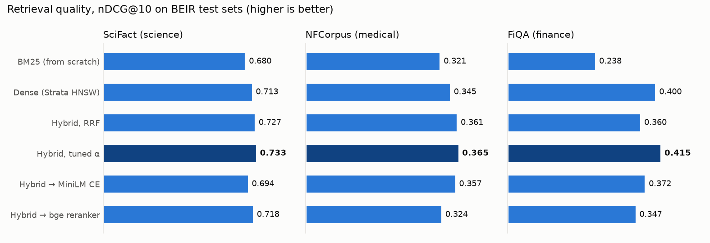
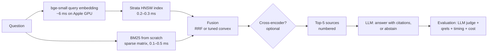

# Evident

**Retrieval-augmented generation where every component is measured.** · **[Live demo](https://evident-rag.streamlit.app)** Evident has these parts:
- hybrid retrieval: BM25 written from scratch, plus dense vectors served by my own vector database
  [Strata](https://github.com/VividhDesign/strata);
- optional cross-encoder reranking;
- answers that must cite their sources, or say they don't know;
- an evaluation harness that scores each stage on public benchmarks: retrieval quality, approximate-search loss,
  per-stage latency, answer faithfulness, citation precision, abstention and cost.

```
Retrieval on 3 BEIR datasets      tuned hybrid wins everywhere: +7.8% / +13.7% / +74% nDCG@10 over BM25
BM25 implementation               matches Pyserini's published numbers within ±0.002 on all three datasets
Strata vs exact vector search     98.5–99.9% identical top-10, nDCG within 0.003
Hybrid retrieval latency          6.9 ms p50 (6.3 ms is the query embedding; vector search 0.3 ms)
Answers (FiQA, 100 questions)     relevant evidence in context 43% → 57% vs BM25; 925 of 936 claims supported
```

<picture>
  <source media="(prefers-color-scheme: dark)" srcset="docs/img/retrieval-ndcg-dark.png">
  
</picture>

## Why

Most RAG demos show a chat box and no numbers, so nobody can tell whether a change helped. Evident is built the
other way round. Every design choice was decided by a measurement:
- **Hybrid instead of dense-only:** +2.8-5.8% nDCG.
- **Tuned fusion instead of RRF:** RRF *loses* to dense-only on FiQA.
- **No reranker by default:** neither cross-encoder beat the tuned hybrid on these datasets, and they cost
  30-170× more latency.

## Pipeline



## Retrieval results

BEIR test sets, nDCG@10 (primary BEIR metric) and Recall@100. The convex weight α is tuned on each dataset's dev
split (train for SciFact) and then frozen. Latency is p50 for one query on FiQA (57,638 docs), Apple M5 Pro.

| System | SciFact | NFCorpus | FiQA | R@100 FiQA | p50 latency |
|---|---:|---:|---:|---:|---:|
| BM25 (from scratch) | 0.680 | 0.321 | 0.238 | 0.537 | 0.4 ms |
| Dense: bge-small + Strata HNSW | 0.713 | 0.345 | 0.400 | 0.686 | 5.9 ms |
| Hybrid, Reciprocal Rank Fusion | 0.727 | 0.361 | 0.360 | 0.691 | 6.6 ms |
| **Hybrid, convex (α tuned on dev)** | **0.733** | **0.365** | **0.415** | 0.689 | 6.9 ms |
| BM25 → MiniLM cross-encoder | 0.687 | 0.350 | 0.329 | 0.537 | 192 ms |
| Hybrid → MiniLM cross-encoder | 0.694 | 0.357 | 0.372 | 0.691 | 204 ms |
| BM25 → bge-reranker-base | 0.710 | 0.321 | 0.315 | 0.537 | 1,180 ms |
| Hybrid → bge-reranker-base | 0.718 | 0.324 | 0.347 | 0.691 | 1,160 ms |

What the numbers say:

1. **The from-scratch components are correct.** BM25 scores 0.680 / 0.321 / 0.238 against Pyserini's published
   0.679 / 0.322 / 0.236. BM25 + MiniLM scores 0.687 / 0.350 against the BEIR paper's 0.688 / 0.350.
   See [docs/METHODOLOGY.md](docs/METHODOLOGY.md#retrieval).
2. **Naive fusion can hurt.** On FiQA, BM25 is much weaker than dense (0.238 vs 0.400). RRF weights them equally
   and drops to 0.360, *below* dense alone. Tuning the weight on held-out queries (α = 0.7 toward dense) fixes it:
   0.415.
3. **Rerankers are not a free win.** Both cross-encoders were trained on MS MARCO web search. On scientific,
   medical and finance text they did not beat the tuned hybrid, at 30-170× the latency. Which reranker was
   better also flipped between datasets (bge on SciFact, MiniLM on NFCorpus and FiQA). Without measuring, I
   would have shipped a slower and worse pipeline.
4. **The approximate vector index costs ~nothing.**

   | Dataset | Strata top-10 identical to exact | nDCG@10, Strata | nDCG@10, exact |
   |---|---:|---:|---:|
   | SciFact | 99.9% | 0.7127 | 0.7127 |
   | NFCorpus | 98.8% | 0.3447 | 0.3432 |
   | FiQA | 98.5% | 0.4003 | 0.4035 |

5. **Where the time goes** (FiQA, hybrid): query embedding 6.3 ms, BM25 0.5 ms, Strata search 0.3 ms, fusion
   0.1 ms. The vector database is the cheapest stage; the embedding model is the bottleneck.

## Answer quality

**Setup.**
- 100 FiQA test questions (fixed seed) with top-5 sources each.
- Generator: `qwen3.5` (9.7B). Judge: `gemma4:12b`, a different model family to limit self-preference. Both run
  locally through Ollama, so the evaluation cost $0.
- Brackets are 95% paired-bootstrap confidence intervals ([results/generation_fiqa_stats.json](results/generation_fiqa_stats.json)).
- 936 claims were judged in total.

| Context given to the LLM | Has a relevant doc | "I don't know" | Faithful claims | Fully faithful answers | Relevance (1–5) | Citation precision | p50 / p95 latency |
|---|---:|---:|---:|---:|---:|---:|---:|
| BM25 top-5 | 43% | 16% | 99.6% | 99% | 4.02 | 0.91 | 4.7 s / 5.8 s |
| **Hybrid top-5 (best retriever)** | **57%** | **8%** | 98.8% | 96% | **4.34** | 0.88 | 5.2 s / 6.6 s |
| Hybrid, relevant docs hidden | 0% | 8% | 96.7% | 87% | 4.13 | 0.84 | 3.5 s / 6.2 s |

What holds up and what doesn't:
- **Better retrieval puts the evidence in front of the model.** A judged-relevant document reaches the context
  for 14 more questions out of 100 (95% CI +5 to +23). "I don't know" answers halve, 16% → 8%; that drop is
  borderline (CI −17 to +1). The relevance gain (+0.19) is within noise at n = 100.
- **The model rarely invents.** Only 11 of 936 claims were unsupported by their sources. Citation precision is
  0.84-0.91, so roughly 1 in 10 citations points at a source that doesn't back that exact sentence. That's the
  next thing to fix.
- **Honest negative result: hiding the evidence did *not* make the model abstain** (8% → 8%). It answered from
  weaker related posts instead, and fully-faithful answers fell from 96% to 87% (CI −15.6 to 0.0). The prompt
  alone is not enough to make an LLM notice that its evidence is weak. The fix I'd try next: gate generation on
  the retrieval score, or ask the judge model to verify support before answering.
- **Latency and cost.** Hybrid retrieval takes 6.9 ms in isolation (~0.1 s while sharing the GPU with the LLM).
  Generation dominates at ~5 s on a laptop. A query averages 1,123 input and 104 output tokens, which at
  published Groq prices is **$0.065 per 1,000 queries** on Llama-3.1-8B or $0.74 on Llama-3.3-70B
  (`evident/prices.json`).

Example (hybrid context; the judge rated it fully faithful, relevance 5/5, citation precision 1.0):

> **Q: Are non-residents or foreigners permitted to buy or own shares of UK companies?**
>
> Yes, it is legal for foreign investors to own shares of UK companies, with statistics showing they were the
> largest holders of UK shares as of 2008 [1]. Investors from outside the UK owned 41.5 per cent of shares listed
> on the London Stock Exchange at the end of 2008 [1].

Every answer, claim verdict and source id is in
[results/generation_fiqa_records.jsonl](results/generation_fiqa_records.jsonl).

## Quickstart

```bash
git clone https://github.com/VividhDesign/evident && cd evident
pip install "git+https://github.com/VividhDesign/strata"   # the vector index (builds C++, needs CMake)
pip install -e ".[app,dev]"
ollama pull qwen3.5 && ollama pull gemma4:12b              # local generator + judge (or use a hosted provider)
```

```bash
evident ask "Should I pay off student loans early or invest?" --corpus fiqa
evident ingest ~/Documents/papers --name papers     # your own PDFs / Markdown / text
evident ask "What does the paper say about class imbalance?" --corpus papers
streamlit run app.py                                 # web UI: answers, sources, latency, cost, eval results

evident eval-retrieval --datasets scifact,nfcorpus,fiqa   # ~45 min on an M-series Mac (downloads BEIR)
evident eval-generation --dataset fiqa --n 100            # ~1.5 h with local 10B-class models
evident calibrate-judge --n 30                            # hand-label claims, measure judge agreement
```

Hosted LLMs: `--provider groq --model openai/gpt-oss-20b` (reads `GROQ_API_KEY`); `gemini` and `openai` work the
same way. All of them use one OpenAI-compatible client. Responses are cached in SQLite, so re-running an
evaluation is free and deterministic.

## Project layout

```
evident/bm25.py           BM25 on a sparse document-term matrix
evident/retriever.py      BM25 / dense / RRF / convex / rerank pipeline, batch + single-query paths
evident/dense.py          Strata HNSW backend and exact brute-force backend
evident/metrics.py        nDCG / Recall / MRR with trec_eval conventions
evident/rag.py            prompt contract, citation parsing, abstention detection
evident/judge.py          LLM-as-judge: claim-level faithfulness, relevance, citation precision
evident/llm.py            Ollama + OpenAI-compatible providers, response cache, token/cost accounting
evident/eval_*.py         the two benchmark runners
app.py                    Streamlit UI
docs/METHODOLOGY.md       what every metric means and where it can mislead
results/                  raw JSON / JSONL behind every number in this README
```

## Tests

```bash
pytest   # 13 tests: BM25 vs hand-computed scores, metrics vs hand-computed values, fusion, chunking,
         # every retrieval mode, Strata vs exact search, citation parsing, abstention, judge scoring (fake LLM)
```

## Limitations

- An LLM judge is not ground truth. `evident calibrate-judge` measures agreement against your own labels.
- 100 questions per condition: differences of a few points are within noise. The per-question records allow
  paired bootstrap tests.
- BEIR qrels are incomplete. A retrieved document can be relevant without being judged, which understates every
  system equally.

## License

MIT
